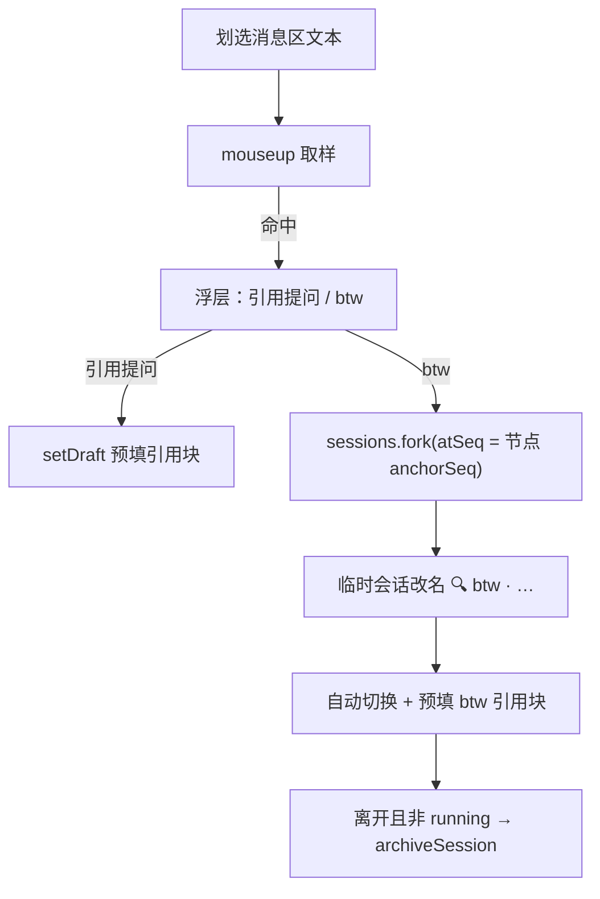

# dsh-btw 💬

> An aside, by the way: quote any selected chat text into the composer, or spin up a one-off temporary session from the selected message — auto-archived when you leave, so the main conversation stays clean.

  

**dsh 临时会话插件**：在会话历史里划选任意内容时浮现操作条——**引用到当前输入框**，或开一个**一次性的 btw 临时会话**（离开即自动归档）。顺手一问，问完即走，不污染当前会话，不弄乱侧边栏。另有**新上下文**：就地切分本会话的模型上下文，历史保留但不再发送。

命名取自 Claude Code 的 `/btw` 习惯：*by the way*，顺便一问，不进主线。

<!-- TODO: 录一段 demo GIF 放到仓库里，替换下面注释

-->

## 功能

| 动作 | 行为 |
|------|------|
| **引用提问** | 选区以「引用块 + 来源头」（含源会话标题与时间）预填进**当前会话**输入框草稿（不发送），继续编辑后发送 |
| **btw** | 从**选中消息所在节点** `fork` 出一个一次性临时会话并自动切换；会话改名「🔍 btw · <源标题>」，输入框预填 btw 引用块 |
| **自动归档** | 离开 btw 会话时自动从侧边栏归档隐藏（running 时顺延到空闲，可在设置关闭） |
| **新上下文** | 输入框工具行的「⧉ 新上下文」按钮（或斜杠命令 `/newcontext`）：就地切分上下文，此前的历史**不再发送给模型**，但会话记录完整保留 |
| **Provider 高级配置** | Models 设置页每个 provider 卡片下新增「高级配置」折叠面板，把 settings.yaml 里的隐藏字段全部可视化；含**模型级配置项**——按模型 id 覆盖 `name` / 容量 / **输入类型 `input`** / `reasoningEfforts` / `compat`（见下节） |

细节：

- 浮层只在**会话消息区**的选区上出现（输入区、设置面板等不触发）；Esc / 滚动 / 点关闭按钮收起；
- 引用块多行逐行加 `> ` 前缀；超过截断长度（默认 2000 字符）加省略号；
- 既有草稿会保留在引用块之后；
- 中英双语文案，随 dsh 界面语言切换；文案缺失时降级中文。

## 安装

要求：dsh 0.1.5-rc.2（web 端）。此前的 0.1.1-rc.2 适配已失效，改动清单见 `CHANGELOG.md` 的 0.1.1 条目。

```sh
# 从本地路径安装（web profile）
dsh plugin --profile web add <本插件目录>

# 或从 GitHub 安装
dsh plugin --profile web add git+https://github.com/<you>/dsh-btw.git

# 确认组合树里出现 dsh-btw
dsh --profile web --dump-config

# 重启 dsh web 并刷新页面，客户端 bundle 才会生效
```

卸载 / 回滚：

```sh
dsh plugin --profile web remove dsh-btw
```

> 注意：boot graph 在服务启动时构建。安装后或修改插件源码后都需要**重启 dsh web**（若以 `link:` 方式安装，源码改动即时生效，但仍需重启让 bundle 重新入图）。

## 新上下文（New context）

同一个会话内的**逻辑切分**：像 Cherry Studio 的「新建话题」，但历史不删、不分叉、不换会话。

- 点输入框工具行的 **⧉ 新上下文**，或直接输入 `/newcontext`；
- 此后发给模型的请求只剩「系统提示 + 一条 notice + 此后新增的消息」——之前的历史全部不再发送；
- **会话记录照旧完整显示**（历史仍在日志里，只是退出模型上下文），可以回看、可以复制；
- **累积**：可以反复切分，每次都从当前状态重切，等效于"只保留最新一段"；
- 分割点是一条写进会话日志的事件，所以**重启 dsh、恢复会话、fork 子会话后依然成立**。

原理：客户端插件碰不到发给模型的 messages（那由 `dsh-agent-loop` 从会话日志的
**可见面 surface** 派生并冻结后交给适配器），所以这个功能由**宿主半边**（`lib/index.js`）
实现 —— 它把 surface 上除系统提示外的全部节点，用一条 replace 操作替换成一条
`plugin: dsh-btw / form: notice` 的 user 消息。这与 `/compact` 是同一套原生机制，
区别只是不生成摘要。按钮只是触发器，内部走 `ISession.command("/newcontext")`，
和你手打斜杠命令同一条路。

## 使用

1. 在会话历史里划选一段内容 → 选区旁浮出操作条；
2. **引用提问**：输入框出现引用块（保留原草稿），编辑补充你的问题后发送；
3. **btw**：切到一次性临时会话「🔍 btw · <源标题>」——历史完整、上下文锚定在选中消息处，输入框已预填 btw 引用块，直接提问；
4. 离开 btw 会话时 → toast「已归档」，侧边栏无残留。
5. **新上下文**：在输入框工具行点「⧉ 新上下文」（或打 `/newcontext`）→ toast 确认，
   此后该会话不再把之前的历史发给模型；继续正常提问即可。



## 设置（localStorage）

| 键 | 默认 | 说明 |
|----|------|------|
| `dsh-btw:autoArchive` | `"1"` | 离开 btw 会话时自动归档；`"0"` 关闭 |
| `dsh-btw:truncateChars` | `"2000"` | 引用文本截断长度（≥100 生效） |
| `dsh-btw:activeBtws` | `[]` | 活跃 btw 会话表（内部持久化，勿手改） |

## Provider 高级配置面板

**设置 → Models** 页，每个 provider 卡片下方有「高级配置（dsh-btw）」折叠面板。dsh 官方 Models 页只暴露 API key / 显示名 / Base URL / 模型列表等基础字段，其余高级参数只能手改 `settings.yaml`——本面板把它们全部可视化，读写走官方 RPC（`settings.describe` / `settings.mutate` 乐观锁），保存时服务端 schema + serviceable 校验兜底。

可视化字段（`llm-pi-ai` 命名空间，`providers.<route>` 下）：

| 分组 | 字段 | 说明 |
|------|------|------|
| 端点与协议 | `displayName` / `baseURL` / `api` | `api ∈ openai-completions \| openai-responses \| anthropic-messages` |
| 超时 | `timeoutMs` / `streamIdleTimeoutMs` / `websocketConnectTimeoutMs` | 毫秒 |
| 传输与缓存 | `transport` / `cacheRetention` / `reasoning` | `transport ∈ auto\|sse\|websocket\|websocket-cached`；`cacheRetention ∈ none\|short\|long`；`reasoning ∈ off…max` |
| thinkingBudgets | `minimal` / `low` / `medium` / `high` | 推理 provider 的 token 预算 |
| 容量与模态兜底 | `defaultContextWindow` / `defaultMaxTokens` / `defaultInput` | 未声明模型的兜底值（默认 262144 / 32768 / `["text"]`）；`defaultInput` 是模型自己没声明 `input` 时的兜底输入类型 |
| headers | 自定义请求头 | 每行 `Name: Value`；凭据请走 apiKeyEnv，勿写入此处 |
| 模型配置 | `modelOverrides.<model>` 全字段 | 见下节：`name` / `contextWindow` / `maxTokens` / **`input`（支持的输入类型）** / `reasoningEfforts` / `compat` |
| retryPolicy | `mode` / `maxRetries` / `retryableCodes` / `backoff.*` | `normal`（可配重试次数与错误码）或 `always` |

### 模型配置项（`modelOverrides.<model>`）

「模型配置」分组按模型 id 逐行覆盖目录里的模型，一行一个模型的全部模型级字段
（= `dsh-llm-pi-ai` schema 的 `modelFields` 全集）：

| 字段 | 控件 | 说明 |
|------|------|------|
| `name` | 文本框 | 显示名 |
| `contextWindow` | 数字框 | 该模型的上下文窗口 |
| `maxTokens` | 数字框 | 该模型的最大输出 |
| `input` | **多选：`text` / `image`** | 该模型**支持的输入类型**（请求模态）。都不勾 = 不声明 = 继承目录；声明 `image` 是让自建视觉模型可用的关键，只声明 `text` 可修正网关并不提供图片的目录模型 |
| `reasoningEfforts` | 三态选择 | 继承目录 / `false`（声明非推理模型，用于剥掉网关服务不了的推理）/ 自定义：文本框每行 `等级: wire 拼写`（等级 ∈ off/minimal/low/medium/high/xhigh/max，wire 留空 = `null`） |
| `compat` | 勾选组 | supportsTemperature / forceAdaptiveThinking / allowEmptySignature / supportsStrictTools / requiresThinkingAsText / supportsCacheControlOnTools |

`input` 是**对端点的声明**而非探测：pi-ai 不会去问网关接受什么，声明了图但端点拒绝，会在回合中途由 provider 报错。

行为细节：

- 字段留空 = **继承目录/协议默认**（保存时 `unset`，不写死值）；
- 只对**改过的字段**生成写入（打开面板时快照做 diff，不把 base 层值钉进 user 层）；
- `modelOverrides` 是整字段重写，但面板读写的正是 `modelFields` 全集，因此**不会丢掉**手写在
  `settings.yaml` 里的其它模型级配置（回归用例见 `scripts/check-form.mjs` 的 round-trip 断言）；
- route 上若已声明 `models` 列表，`modelOverrides` 与之互斥（服务端拒绝），面板会就地提示；
- 配置冲突（别处同时改动）会明确提示，收起重新展开即可；
- 凭据仍走官方 API key 表单（credentials seam），本面板不碰密钥。

## 工作原理

纯客户端插件，只走 dsh 公开扩展面，**零核心改动**：

- **浮层**：注册到 `shell.overlay` 座位（root 作用域），document 级 mouseup + rAF 取样，用 ui-conversation 自身的 `data-conversation-scroll` / `data-chat-anchor-key` DOM 锚点判定选区位置；
- **会话桥**：注册到 `conversation.session.header.utilities` 座位（session 作用域，零渲染高度），借 standard kit 拿到 `inputActions.setDraft`、输入草稿快照与 `useChat` 的聊天节点面，提升给 root 作用域的浮层使用；
- **fork 锚点**：`useChat((s) => s.nodes)` 拿到的 `ChatNodeStore.get(选中行 data-chat-anchor-key).anchorSeq` 定位选中节点（dsh 0.1.5 起 `SessionSnapshot` 已无 `chat`，节点面只能从 session 作用域的 kit 取）；fork 后 `child.rename()` 钉住临时会话标题（不被 LLM 自动再生）；
- **归档 watcher**：root 级订阅 `sessions.list`，当前选择离开"活跃 btw 会话"且该会话不在 running 时调用 `workspaces.archiveSession`；
- **配置面板**：注册到官方预留的 `settings.models.provider-card` 座位（ui-settings-models 声明；0.1.5 起为 keyed 座位，注册键 = `key: "llm-pi-ai"`），读 `settings.describe()`、写 `settings.mutate(ns, ops, revision)`（乐观锁 revision），diff 后最小化写入；模型级字段落在 `modelOverrides.<model>` 的 `modelFields` 全集上（`input` 即输入类型多选）；
- **新上下文**：宿主半边注册 `/newcontext` 命令（`ctx.commands.register`），把会话 surface 上除系统提示外的全部节点 replace 成一条 notice；客户端按钮注册到 `conversation.input.left`，点击走 `ISession.command`；
- **宿主半边**：`lib/index.js` 是真正的 cordis 插件（`inject: ["commands","sessions"]`），零运行时依赖（notice 消息手工构造，不 import `@deepseek-ai/*`，因为 link 安装的目录解析不到它们）；
- hooks 纪律：任何 hook 都不条件调用（`useInput` / `useChat` 各由内层子组件无条件调用，组件本身按宿主能力条件渲染）。

## 兼容性（dsh 升级时的核对清单）

本插件只走公开扩展面，但公开面本身会随版本漂移。实测基线：**dsh 0.1.5-rc.2**。升级后请依次核对：

| 依赖面 | 位置 | 0.1.5 现状 |
|--------|------|------------|
| Cordis `inject` 服务 key | `lib/client.js` 尾部 | `slots / sessions / workspaces / locale / remote / remote.settings`（**必须是服务名，不是包名**） |
| `shell.overlay` 座位 | 浮层 | list 座位，注册 `{ id }` |
| `conversation.session.header.utilities` 座位 + standard kit | 会话桥 | `useInput` / `inputActions.setDraft` / `useChat` 均在 |
| `settings.models.provider-card` 座位 | 配置面板 | **keyed** 座位，注册 `{ key: "llm-pi-ai" }` |
| `settings.describe()` / `settings.mutate(ns, ops, rev)` | 配置面板 | describe 无参、`writable` 在信封顶层；mutate 结果含 `revision`；冲突码 `settings/conflict` |
| `sessions.list` / `.binding` / `.fork({sessionId, atSeq})` / `.open` | fork 与归档 | 均在 |
| `workspaces.archiveSession` | 自动归档 | 在（单向，无 unarchive） |
| `commands.register` + `sessions.get` | 宿主半 /newcontext | 在；命令定义全局可见 |
| surface replace 契约（`session.surface.nodes` / `append(..., { surfaceOp })`） | 宿主半切分 | 与 `/compact` 同一机制，规则由 `scripts/check-newcontext.mjs` 对着真实 `dsh-session` 验证 |
| DOM 锚点 | 选区判定 | `data-conversation-scroll` / `data-chat-anchor-key` / `data-composer-seat` 均在；`data-input-mirror` 已移除 |

自检会覆盖其中可静态断言的部分：

```sh
node scripts/check.mjs           # 语法 + 结构 + 清单断言
node scripts/check-newcontext.mjs # 用部署里真实的 dsh-session 验证切分契约
```

## 已知限制

- **归档是单向操作**（当前 dsh 版本没有 unarchive API）：归档后仅从侧边栏隐藏，会话日志仍在磁盘 `~/.dsh/sessions/` 下，数据不会丢；
- 正在运行的回合（streaming 尾部）不能作为 fork 锚点，此时 btw 按钮会给出提示；
- 依赖 ui-conversation 的 `data-*` DOM 锚点：dsh 升级若改变这些属性，需同步本插件的选择器常量；
- 宿主若不再提供 `useChat`（聊天节点面缺席），btw 仍可 fork，但锚点退回 fork 的缺省边界——即从已完成回合的末尾切，而不是从选中消息处切。

## FAQ

**Q: 为什么叫 btw？**
A: 沿用 Claude Code 的 `/btw`——by the way，顺手一问。btw 会话是一次性的：问完离开即自动归档，主线与侧边栏都保持干净。

**Q: 我的原始会话标题看起来被加了后缀？**
A: 不是本插件。dsh 会自动用 LLM 根据你的第一句话生成会话标题，措辞纯属巧合。本插件只给 btw **临时会话**改名（`🔍 btw · …`），从不修改源会话。

**Q: 归档的 btw 会话去哪了？**
A: 只是从侧边栏隐藏，日志仍在 `~/.dsh/sessions/<工作区>/` 下，可以随时去磁盘查看。

**Q: 划选后浮层没出现？**
A: 浮层只在会话消息区生效；输入框、本浮层自身等区域被排除，少于 2 个字符的选区也会被忽略。

## 开发

```
dsh-btw/
├── lib/
│   ├── client.js    # 浏览器半边：手写 CJS factory（ModuleLoader），交互功能所在
│   └── index.js     # 服务端半边：/newcontext 命令 —— 把一段历史移出模型上下文
├── cordis.patch.yml # 组合树 patch（insert 插件节点）
├── scripts/check.mjs           # 静态自检（语法 + 结构断言）
├── scripts/check-newcontext.mjs # 切分契约测试（对付真实 dsh-session 的 foldSurface）
└── package.json     # dsh.client.platform = "web"、exports["./client"]
```

自检：

```sh
node scripts/check.mjs
node scripts/check-newcontext.mjs
```

无需构建器：`lib/client.js` 是手写的 CommonJS factory（`window.__ModuleLoader__.load({ id, factory })`），运行时依赖由 dsh 注入（react 为 shell 预置种子模块）。修改源码后重启 dsh web 即可看到效果。

## License

[MIT](./LICENSE)
