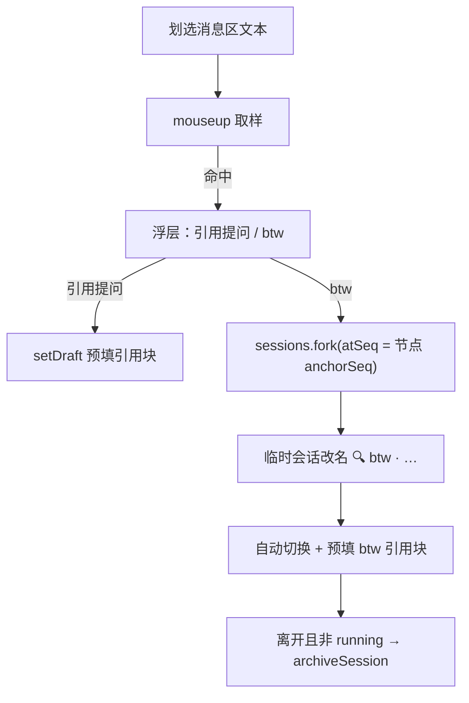

# dsh-btw 💬

> An aside, by the way: quote any selected chat text into the composer, or spin up a one-off temporary session from the selected message — auto-archived when you leave, so the main conversation stays clean.

  

**dsh 临时会话插件**：在会话历史里划选任意内容时浮现操作条——**引用到当前输入框**，或开一个**一次性的 btw 临时会话**（离开即自动归档）。顺手一问，问完即走，不污染当前会话，不弄乱侧边栏。

命名取自 Claude Code 的 `/btw` 习惯：*by the way*，顺便一问，不进主线。

<!-- TODO: 录一段 demo GIF 放到仓库里，替换下面注释

-->

## 功能

| 动作 | 行为 |
|------|------|
| **引用提问** | 选区以「引用块 + 来源头」（含源会话标题与时间）预填进**当前会话**输入框草稿（不发送），继续编辑后发送 |
| **btw** | 从**选中消息所在节点** `fork` 出一个一次性临时会话并自动切换；会话改名「🔍 btw · <源标题>」，输入框预填 btw 引用块 |
| **自动归档** | 离开 btw 会话时自动从侧边栏归档隐藏（running 时顺延到空闲，可在设置关闭） |

细节：

- 浮层只在**会话消息区**的选区上出现（输入区、设置面板等不触发）；Esc / 滚动 / 点关闭按钮收起；
- 引用块多行逐行加 `> ` 前缀；超过截断长度（默认 2000 字符）加省略号；
- 既有草稿会保留在引用块之后；
- 中英双语文案，随 dsh 界面语言切换；文案缺失时降级中文。

## 安装

要求：dsh ≥ 0.1.x（web 端）。开发与实测环境为 dsh 0.1.1-rc.2。

```sh
# 从本地路径安装（web profile）
dsh plugin --profile web add <本插件目录>

# 或从 GitHub 安装
dsh plugin --profile web add git+https://github.com/<you>/dsh-btw.git

# 确认组合树里出现 dsh-btw
dsh --profile web --dump-config

# 重启 dsh web 并刷新页面，客户端 bundle 才会生效
```

卸载 / 回滚：

```sh
dsh plugin --profile web remove dsh-btw
```

> 注意：boot graph 在服务启动时构建。安装后或修改插件源码后都需要**重启 dsh web**（若以 `link:` 方式安装，源码改动即时生效，但仍需重启让 bundle 重新入图）。

## 使用

1. 在会话历史里划选一段内容 → 选区旁浮出操作条；
2. **引用提问**：输入框出现引用块（保留原草稿），编辑补充你的问题后发送；
3. **btw**：切到一次性临时会话「🔍 btw · <源标题>」——历史完整、上下文锚定在选中消息处，输入框已预填 btw 引用块，直接提问；
4. 离开 btw 会话时 → toast「已归档」，侧边栏无残留。



## 设置（localStorage）

| 键 | 默认 | 说明 |
|----|------|------|
| `dsh-btw:autoArchive` | `"1"` | 离开 btw 会话时自动归档；`"0"` 关闭 |
| `dsh-btw:truncateChars` | `"2000"` | 引用文本截断长度（≥100 生效） |
| `dsh-btw:activeBtws` | `[]` | 活跃 btw 会话表（内部持久化，勿手改） |

## 工作原理

纯客户端插件，只走 dsh 公开扩展面，**零核心改动**：

- **浮层**：注册到 `shell.overlay` 座位（root 作用域），document 级 mouseup + rAF 取样，用 ui-conversation 自身的 `data-conversation-scroll` / `data-chat-anchor-key` DOM 锚点判定选区位置；
- **会话桥**：注册到 `conversation.session.header.utilities` 座位（session 作用域，零渲染高度），借 standard kit 拿到 `inputActions.setDraft` 与输入草稿快照，提升给 root 作用域的浮层使用；
- **fork 锚点**：`binding.session.getSnapshot().chat.nodes.get(key).anchorSeq` 定位选中节点；fork 后 `child.rename()` 钉住临时会话标题（不被 LLM 自动再生）；
- **归档 watcher**：root 级订阅 `sessions.list`，当前选择离开"活跃 btw 会话"且该会话不在 running 时调用 `workspaces.archiveSession`；
- hooks 纪律：任何 hook 都不条件调用（`useInput` 由内层子组件无条件调用）。

## 已知限制

- **归档是单向操作**（当前 dsh 版本没有 unarchive API）：归档后仅从侧边栏隐藏，会话日志仍在磁盘 `~/.dsh/sessions/` 下，数据不会丢；
- 正在运行的回合（streaming 尾部）不能作为 fork 锚点，此时 btw 按钮会给出提示；
- 依赖 ui-conversation 的 `data-*` DOM 锚点：dsh 升级若改变这些属性，需同步本插件的选择器常量。

## FAQ

**Q: 为什么叫 btw？**
A: 沿用 Claude Code 的 `/btw`——by the way，顺手一问。btw 会话是一次性的：问完离开即自动归档，主线与侧边栏都保持干净。

**Q: 我的原始会话标题看起来被加了后缀？**
A: 不是本插件。dsh 会自动用 LLM 根据你的第一句话生成会话标题，措辞纯属巧合。本插件只给 btw **临时会话**改名（`🔍 btw · …`），从不修改源会话。

**Q: 归档的 btw 会话去哪了？**
A: 只是从侧边栏隐藏，日志仍在 `~/.dsh/sessions/<工作区>/` 下，可以随时去磁盘查看。

**Q: 划选后浮层没出现？**
A: 浮层只在会话消息区生效；输入框、本浮层自身等区域被排除，少于 2 个字符的选区也会被忽略。

## 开发

```
dsh-btw/
├── lib/
│   ├── client.js    # 浏览器半边：手写 CJS factory（ModuleLoader），全部功能所在
│   └── index.js     # 服务端半边：命名导出 no-op（预留 M2 服务端能力）
├── cordis.patch.yml # 组合树 patch（insert 插件节点）
├── scripts/check.mjs # 静态自检（语法 + 结构断言）
└── package.json     # dsh.client.platform = "web"、exports["./client"]
```

自检：

```sh
node scripts/check.mjs
```

无需构建器：`lib/client.js` 是手写的 CommonJS factory（`window.__ModuleLoader__.load({ id, factory })`），运行时依赖由 dsh 注入（react 为 shell 预置种子模块）。修改源码后重启 dsh web 即可看到效果。

## License

[MIT](./LICENSE)
